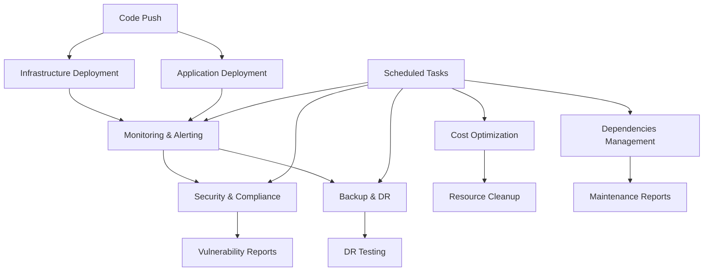

# AWS Workflows Summary for Online Book Store

This document provides a comprehensive overview of all AWS workflows created for the online book store application. These workflows implement a complete DevOps pipeline with infrastructure management, application deployment, monitoring, security, and cost optimization.

## 📋 Complete Workflow List

### Core Workflows

1. **`aws-deploy-infrastructure.yml`** - Infrastructure Deployment
   - **Purpose**: Deploy AWS infrastructure using Terraform
   - **Triggers**: Push to main (infrastructure changes), PR for planning, manual dispatch
   - **Features**: Terraform plan/apply, multi-environment support, state management

2. **`aws-deploy-application.yml`** - Application Deployment  
   - **Purpose**: Build, test, and deploy the book store application
   - **Triggers**: Push to main (application changes), PR for testing, manual dispatch
   - **Features**: Testing, security scanning, Docker builds, ECS deployment, health checks

3. **`aws-monitoring-alerts.yml`** - Monitoring & Alerting
   - **Purpose**: Continuous monitoring and alerting
   - **Triggers**: Scheduled (every 15 minutes), push to main, manual dispatch
   - **Features**: Health checks, performance monitoring, cost alerts, security monitoring

4. **`aws-backup-disaster-recovery.yml`** - Backup & Disaster Recovery
   - **Purpose**: Automated backup and DR operations
   - **Triggers**: Daily backups (2 AM UTC), weekly DR tests (Sunday 3 AM UTC), manual dispatch
   - **Features**: RDS snapshots, S3 backups, cross-region replication, DR testing

5. **`aws-security-compliance.yml`** - Security & Compliance
   - **Purpose**: Comprehensive security scanning and compliance
   - **Triggers**: Daily security scans (1 AM UTC), weekly compliance (Monday 2 AM UTC), push/PR
   - **Features**: Vulnerability scanning, secret detection, compliance checking, penetration testing

### Management Workflows

6. **`aws-workflow-dependencies.yml`** - Dependencies Management
   - **Purpose**: Manage and update workflow dependencies
   - **Triggers**: Weekly (Sunday 4 AM UTC), push to workflows, manual dispatch
   - **Features**: Action version checks, tool updates, security audits, maintenance reports

7. **`aws-cost-optimization.yml`** - Cost Optimization
   - **Purpose**: Cost analysis and resource optimization
   - **Triggers**: Daily cost analysis (6 AM UTC), weekly cleanup (Sunday 5 AM UTC), manual dispatch
   - **Features**: Cost reporting, resource cleanup, right-sizing analysis, RI recommendations

### Legacy Workflow

8. **`blank.yml`** - Original Sample Workflow
   - **Purpose**: Basic GitHub Actions example (replaced by comprehensive AWS workflows)
   - **Status**: Can be removed after AWS workflows are validated

## 🎯 Workflow Architecture



## 🚀 Deployment Flow

### 1. Infrastructure Pipeline
```
Push to infrastructure/ → Terraform Plan → Manual Approval → Terraform Apply → Infrastructure Ready
```

### 2. Application Pipeline  
```
Push to src/ → Tests → Security Scan → Build Docker → Push to ECR → Deploy to ECS → Health Checks
```

### 3. Monitoring Pipeline
```
Every 15 minutes → Health Checks → Performance Metrics → Cost Analysis → Alerts (if needed)
```

### 4. Security Pipeline
```
Daily → Vulnerability Scan → Secret Detection → Compliance Check → Security Report
```

### 5. Backup Pipeline
```
Daily 2 AM → RDS Snapshot → S3 Backup → Cross-region Copy → Cleanup Old Backups
```

## 📊 Workflow Features Matrix

| Workflow | Multi-Env | Scheduling | Manual Trigger | Notifications | Reporting |
|----------|-----------|------------|----------------|---------------|-----------|
| Infrastructure | ✅ | ❌ | ✅ | ✅ | ✅ |
| Application | ✅ | ❌ | ✅ | ✅ | ✅ |
| Monitoring | ✅ | ✅ | ✅ | ✅ | ✅ |
| Backup & DR | ✅ | ✅ | ✅ | ✅ | ✅ |
| Security | ✅ | ✅ | ✅ | ✅ | ✅ |
| Dependencies | ❌ | ✅ | ✅ | ❌ | ✅ |
| Cost Optimization | ✅ | ✅ | ✅ | ✅ | ✅ |

## 🔒 Security Implementation

### Secret Management
- All sensitive data stored in GitHub Secrets
- AWS credentials managed securely
- No hardcoded secrets in workflows

### Access Control
- Environment protection rules
- Manual approvals for production
- Least privilege IAM policies

### Compliance Features
- Automated vulnerability scanning
- Secret detection in code
- AWS Config compliance checking
- Security audit reporting

## 💰 Cost Management

### Cost Monitoring
- Daily cost analysis and reporting
- Budget tracking and alerts
- Service-level cost breakdown
- Trend analysis and projections

### Cost Optimization
- Automated resource cleanup
- Right-sizing recommendations
- Reserved instance analysis
- Unused resource identification

## 🔧 Maintenance & Updates

### Automated Maintenance
- Weekly dependency checks
- Action version updates
- Tool version monitoring
- Security audit reporting

### Manual Operations
- Infrastructure deployments
- Application rollbacks
- Disaster recovery testing
- Cost optimization actions

## 📈 Monitoring & Alerting

### Health Monitoring
- Application endpoint checks
- Database connectivity tests
- Load balancer health
- ECS service status

### Performance Monitoring  
- CPU and memory utilization
- Response time tracking
- Error rate monitoring
- Cost threshold alerts

### Security Monitoring
- GuardDuty integration
- CloudTrail analysis
- Failed login detection
- Vulnerability alerts

## 🎛️ Usage Guidelines

### Getting Started
1. Set up required GitHub secrets
2. Create GitHub environments
3. Configure AWS prerequisites
4. Deploy infrastructure first
5. Deploy application
6. Monitor and maintain

### Best Practices
- Always test in development first
- Review security scan results
- Monitor cost reports regularly
- Keep dependencies updated
- Maintain proper resource tagging

### Troubleshooting
- Check GitHub Actions logs
- Review AWS CloudTrail
- Verify IAM permissions
- Check resource quotas
- Monitor AWS service health

## 📅 Recommended Schedule

### Daily Operations
- **1 AM UTC**: Security scans run automatically
- **2 AM UTC**: Backup operations execute
- **6 AM UTC**: Cost analysis reports generated
- **Every 15 min**: Health checks performed

### Weekly Operations
- **Sunday 3 AM UTC**: Disaster recovery testing
- **Sunday 4 AM UTC**: Dependency updates
- **Sunday 5 AM UTC**: Resource cleanup
- **Monday 2 AM UTC**: Compliance checks

### Monthly Operations
- Review cost optimization reports
- Update workflow dependencies
- Review security compliance status
- Plan infrastructure improvements

## 🔗 Integration Points

### External Services
- **Slack**: Deployment notifications
- **SNS**: Alert notifications  
- **CodeCov**: Test coverage reports
- **GitHub Security**: Vulnerability reports

### AWS Services
- **ECS**: Container orchestration
- **RDS**: Database management
- **ECR**: Container registry
- **CloudWatch**: Monitoring and logging
- **GuardDuty**: Security monitoring
- **Cost Explorer**: Cost analysis

## 📝 Next Steps

1. **Immediate**: Deploy and test workflows in development
2. **Short-term**: Configure production environments
3. **Medium-term**: Add custom business metrics
4. **Long-term**: Implement advanced automation

---

*This comprehensive AWS workflow suite provides enterprise-grade DevOps automation for the online book store application, ensuring scalability, security, and cost-effectiveness.*